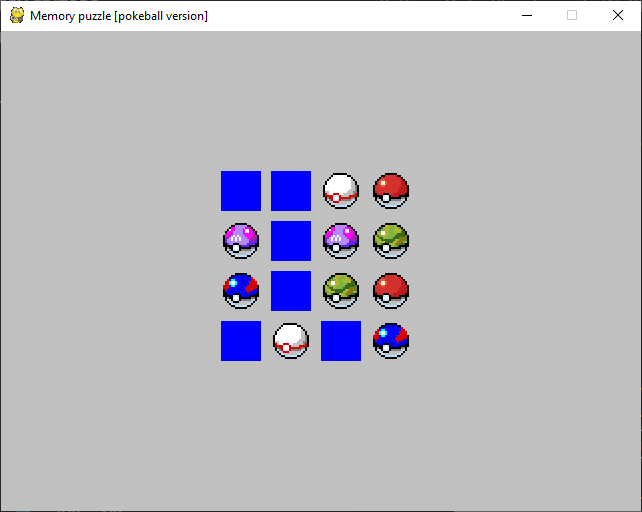

# Memory-puzzle
Memory puzzle game wrote in Python

## Table of contents
* [General info](#general-info)
* [Technologies](#technologies)
* [Setup](#setup)
* [Version](#version)

## General Info
The memory puzzle game is one of the most simple and famous games. It consists in a board with pairs of images, but those are hidden. You will try to discover all of these pairs by revealing two by two. When you reveal a pair, those icons will stay untapped until you discover all others.



## Technologies
* Python: 3.8.3
* Pygame: 1.9.6

You can also see your python version by typing in the command line:
````
python --version
```` 
And all your libraries versions:
````
python -m pip list
````

## Setup
You can download the repo by typing in a git console (bash):
````
git clone https://github.com/Adri-md-1208/Python-Data-Structures.git
````
Or by downloading the last version in the tag section.

## Version
1.0